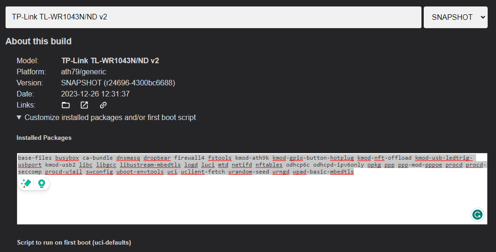

# Useful OpenWRT configurations

## General configs

### Set password for UI

```bash
passwd
```

### System settings

```bash
uci set system.@system[0].zonename='Europe/Ljubljana'
uci set system.@system[0].timezone='CET-1CEST,M3.5.0,M10.5.0/3'
uci set system.@system[0].hostname=GW-TP-Link-Archer-C7 #Change te device name here
```

## Setup Modes

### AP Mode

Official documentation: https://openwrt.org/docs/guide-user/network/wifi/dumbap

By default, the main router will have an address of 192.168.1.1

#### Set dynamic IP, disable wan, wan6 and disable services to safe resources

If you need static IP, better reserve in router.
You can also delete the WAN and WAN& interfaces in UI.

```bash
uci set network.lan.proto="dhcp"
uci set dhcp.lan.ignore=1
uci set dhcp.lan.ra='disable'
uci set dhcp.lan.dhcpv6='disable'
uci set dhcp.lan.ndp='disable'
uci set network.wan.proto='none'
uci set network.wan.auto='0'
uci set network.wan6.proto='none'
uci set network.wan6.auto='0'
service dnsmasq disable
service dnsmasq stop
service odhcpd disable
service odhcpd stop
service firewall disable
service firewall stop # Note even though these services are now disabled, after you flash a new image to the device they will be re-enabled.
uci commit
reboot
```

After reboot reserve a static IP in gateway router and go to that IP to manage further.

#### Enable Wifi 2G

```bash
uci set wireless.radio0=wifi-device
uci set wireless.radio0.band='2g'
uci set wireless.radio0.htmode='HT20'
uci set wireless.radio0.country='SI'
uci set wireless.radio0.cell_density='0'
uci set wireless.radio0.channel='auto'
uci set wireless.radio0.disabled='0'
uci set wireless.default_radio0=wifi-iface
uci set wireless.default_radio0.device='radio0'
uci set wireless.default_radio0.network='lan'
uci set wireless.default_radio0.mode='ap'
uci set wireless.default_radio0.key='PASSWORD' # Enter password here
uci set wireless.default_radio0.encryption='sae-mixed'
uci set wireless.default_radio0.ssid='rw_podstresje' # Enter SSID
uci commit
wifi up #Turns Wifi ON
```

#### Disable Daemons Persistently

Add bellow for loop to /etc/rc.local. You can access this also in the UI. System > Startup > Local Startup

```bash
# these services do not run on dumb APs
for i in firewall dnsmasq odhcpd; do
  if /etc/init.d/"$i" enabled; then
    /etc/init.d/"$i" disable
    /etc/init.d/"$i" stop
  fi
done

```


### Router Mode

Official documentation: https://openwrt.org/docs/guide-user/network/openwrt_as_routerdevice

By default, the LAN ports of the router will have an address of 192.168.1.1

#### When Flashing a device use customized packages



Add this packages to the installer:

```bash
nano-full etherwake luci-app-wol ddns-scripts ddns-scripts-services luci-app-ddns

```

##### or use client builder

```bash
mkdir openwrtbuild
cd openwrtbuild/
wget https://downloads.openwrt.org/releases/23.05.2/targets/ath79/generic/openwrt-imagebuilder-23.05.2-ath79-generic.Linux-x86_64.tar.xz
tar -J -x -f openwrt-imagebuilder-*.tar.xz
rm openwrt-imagebuilder-23.05.2-ath79-generic.Linux-x86_64.tar.xz
cd openwrt-imagebuilder-*/
make image PROFILE=tplink_tl-wr1043nd-v2 PACKAGES="nano-full etherwake luci-app-wol ddns-scripts ddns-scripts-services luci-app-ddns"
cd bin/targets/ath79/generic/
ls
openwrt-23.05.2-ath79-generic-tplink_tl-wr1043nd-v2.manifest
openwrt-23.05.2-ath79-generic-tplink_tl-wr1043nd-v2-squashfs-factory.bin
openwrt-23.05.2-ath79-generic-tplink_tl-wr1043nd-v2-squashfs-sysupgrade.bin
profiles.json
sha256sums
```


#### Static IP settings, DHCP, Firewall syn-flood

```bash
# uci show dhcp.lan
uci set network.lan.proto="static"
uci set network.lan.ipaddr="192.168.84.1"
uci set network.lan.netmask="255.255.255.0"
uci set dhcp.lan=dhcp
uci set dhcp.lan.interface='lan'
uci set dhcp.lan.start='50'
uci set dhcp.lan.limit='150'
uci set dhcp.lan.leasetime='12h'
uci set dhcp.lan.dhcp_option='6,192.168.84.22' #Pihole server address
uci set dhcp.lan.ra='disable'
uci set dhcp.lan.dhcpv6='disable'
uci set dhcp.lan.ndp='disable'
uci set dhcp.wan.ra='disable'
uci set dhcp.wan.dhcpv6='disable'
uci set dhcp.wan.ndp='disable'
uci set firewall.@defaults[0].syn_flood='1'
uci commit
reboot

```

#### SSH KEY Pair Generate and Upload

Make a SSH keypair for easy management.

##### Windows shell

```bash
ssh-keygen -t ed25519 -C "gateway"

```

When asked rename to: `C:\Users\Jure/.ssh/id_gateway`

upload:

```bash
scp $env:USERPROFILE/.ssh/id_gateway.pub root@192.168.X.X:/etc/dropbear/authorized_keys
```

##### Disable password authentication (OpenWRT CLI)

```bash
uci set dropbear.@dropbear[0].PasswordAuth="0"
uci set dropbear.@dropbear[0].RootPasswordAuth="0"
uci commit
service dropbear restart

```

#### Common router software

##### DDNS and Nano Full

Install:
```bash
opkg update
opkg install ddns-scripts
opkg install ddns-scripts-services
opkg install luci-app-ddns
#opkg install luci-i18n-ddns-en
opkg install nano-full
opkg install etherwake
opkg install luci-app-wol

```
DDNS config:
```bash
uci set ddns.duckdns=service
uci set ddns.duckdns.service_name='duckdns.org'
uci set ddns.duckdns.use_ipv6='0'
uci set ddns.duckdns.domain='pernica.duckdns.org'
uci set ddns.duckdns.username='pernica'
uci set ddns.duckdns.password='789f7e15-17fd-49ef-8e8b-2a0b6487c0c5'
uci set ddns.duckdns.ip_source='network'
uci set ddns.duckdns.ip_network='wan'
uci set ddns.duckdns.use_syslog='2'
uci set ddns.duckdns.check_unit='hours'
uci set ddns.duckdns.force_unit='hours'
uci set ddns.duckdns.retry_unit='seconds'
uci set ddns.duckdns.interface='wan'
uci set ddns.duckdns.lookup_host='pernica.duckdns.org'
uci set ddns.duckdns.enabled='1'
uci set ddns.duckdns.check_interval='6'
uci commit
service ddns restart

```

#### Ports forwards

UCI is useful to view the firewall configuration, but not to do any meaningful modifications. Add port forward rules in UI or configuration file in `/etc/config/firewall`

```yml
config redirect
        option dest 'lan'
        option target 'DNAT'
        option name 'Plex'
        list proto 'tcp'
        option src 'wan'
        option src_dport '32400'
        option dest_ip '192.168.84.10'
        option dest_port '32400'

config redirect
        option dest 'lan'
        option target 'DNAT'
        option name 'Wireguard'
        list proto 'udp'
        option src 'wan'
        option src_dport '51820'
        option dest_ip '192.168.84.25'
        option dest_port '51820'

config redirect
        option dest 'lan'
        option target 'DNAT'
        option name 'Storj'
        list proto 'tcp'
        list proto 'udp'
        option src 'wan'
        option src_dport '28967'
        option dest_ip '192.168.84.10'
        option dest_port '28967'

```
Restart firewall for effect
```bash
service firewall restart
```


## Notes

To see pending changes use:
```bash
uci changes
```

Make a restore:

```bash
firstboot -y && reboot
```